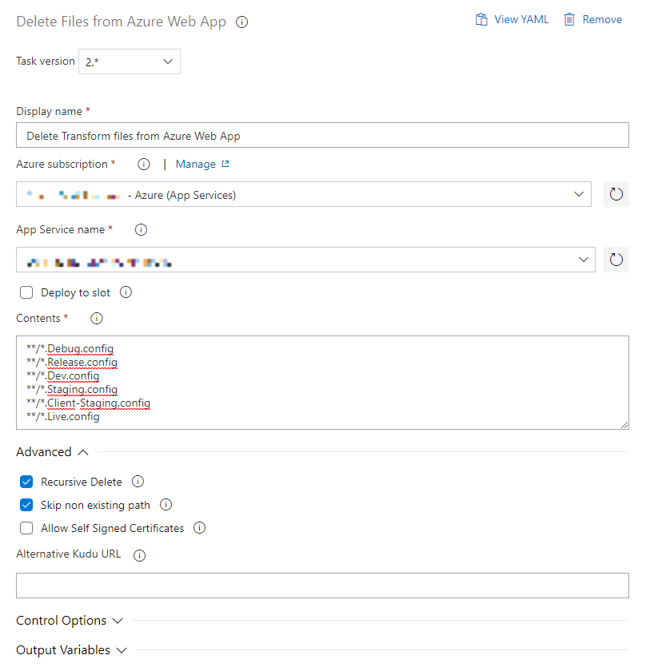

# Delete Files from Azure Web App - Deployment Task

A custom Azure DevOps deployment task for deleting files and/or folders from the app service.

## Features coming from previous forks:

- deployment slot support
- general fixes

## New features:

- wildcards for recursive deletion

If you want to deploy this extension and use it as a part of your build, please consult Microsoft's documentation: https://docs.microsoft.com/en-us/azure/devops/extend/publish/overview?view=azure-devops. It's simple!

## Why not simply use "Remove additional files at destination"?

Good question. It is true that Azure app service deployment has built-in functionality for removing files that don't exist in the artifact from the app service. We however noticed that this functionality is **very slow**, especially for our scenario: we're deploying NodeJS webapps and we install packages as part of deployment in the app service instead of carrying them over from the build process. As part of every deployment, with "Remove additional files at destination" enabled, we'd spend 5-10 minutes removing node_modules. NPM/Yarn can handle this itself, so we started looking for a way to delete only the files & folders we care about.

## Credits

- https://github.com/iffa/VSTS-Build-AzureWebAppVFS (latest version used as a base of this fork)
- https://github.com/Geertvdc/VSTS-Build-AzureWebAppVFS (original version)
- https://github.com/NielsSchneider/VSTS-Build-AzureWebAppVFS (deployment slot support, base of iffa's fork)